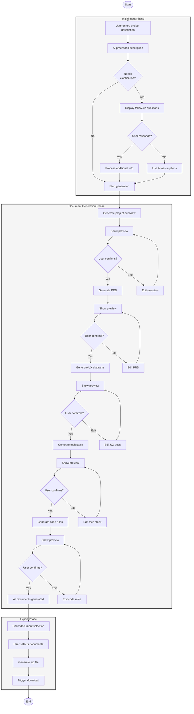

# ai-charter - UX Flow Diagrams

```mermaid
flowchart TD
    Start([Start]) --> InitialInput[User enters project description]
    
    subgraph Input["Initial Input Phase"]
        InitialInput --> AIProcess[AI processes description]
        AIProcess --> Questions{Needs\nclarification?}
        
        Questions -->|Yes| ShowQuestions[Display follow-up questions]
        ShowQuestions --> UserResponds{User responds?}
        UserResponds -->|Yes| ProcessAnswers[Process additional info]
        UserResponds -->|No| UseDefaults[Use AI assumptions]
        
        Questions -->|No| StartGen
        ProcessAnswers --> StartGen
        UseDefaults --> StartGen
    end
    
    subgraph Generation["Document Generation Phase"]
        StartGen[Start generation] --> Overview
        
        Overview[Generate project overview] --> ShowOverview[Show preview]
        ShowOverview --> ConfirmOverview{User confirms?}
        ConfirmOverview -->|Yes| PRD
        ConfirmOverview -->|Edit| EditOverview[Edit overview]
        EditOverview --> ShowOverview
        
        PRD[Generate PRD] --> ShowPRD[Show preview]
        ShowPRD --> ConfirmPRD{User confirms?}
        ConfirmPRD -->|Yes| UXDocs
        ConfirmPRD -->|Edit| EditPRD[Edit PRD]
        EditPRD --> ShowPRD
        
        UXDocs[Generate UX diagrams] --> ShowUX[Show preview]
        ShowUX --> ConfirmUX{User confirms?}
        ConfirmUX -->|Yes| TechStack
        ConfirmUX -->|Edit| EditUX[Edit UX docs]
        EditUX --> ShowUX
        
        TechStack[Generate tech stack] --> ShowTech[Show preview]
        ShowTech --> ConfirmTech{User confirms?}
        ConfirmTech -->|Yes| CodeRules
        ConfirmTech -->|Edit| EditTech[Edit tech stack]
        EditTech --> ShowTech
        
        CodeRules[Generate code rules] --> ShowRules[Show preview]
        ShowRules --> ConfirmRules{User confirms?}
        ConfirmRules -->|Yes| Complete
        ConfirmRules -->|Edit| EditRules[Edit code rules]
        EditRules --> ShowRules
    end
    
    subgraph Export["Export Phase"]
        Complete[All documents generated] --> Selection[Show document selection]
        Selection --> UserSelects[User selects documents]
        UserSelects --> CreateZip[Generate zip file]
        CreateZip --> Download[Trigger download]
    end
    
    Download --> End([End])
    
    style Generation fill:#f5f5f5,stroke:#333,stroke-width:2px
    style Input fill:#f5f5f5,stroke:#333,stroke-width:2px
    style Export fill:#f5f5f5,stroke:#333,stroke-width:2px
```